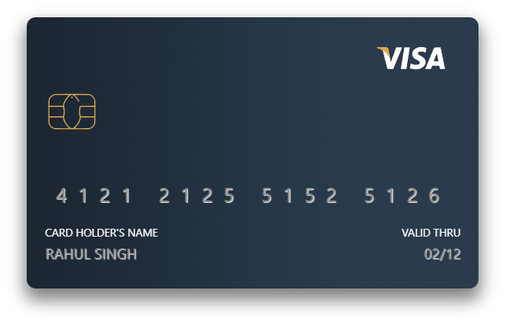

# Getting Started with React Payment Cards

React Payment Cards is a beautiful React component that creates a virtual avatar of your credit/debit card to enhance the user experience.

## Installation

`npm install react-payment-cards`

## Usage

```js
const cardDetails = {
  cardHolderName: "Rahul Singh",
  cardValidity: "02/12",
  cardSecurityCode: "776",
  cardNumber: "4121212551525126",
};

<PaymentCard
  cardDetails={cardDetails}
  flipped={false} // Pass `true` to see the back of the card on first load
  cardBgColor="sea" // sea | blood | night
/>;
```



Refer to `FullExample.js` for complete implementation

## Contributing

Create a `feature` or `fix` branch based on your contribution and then create a pull request.

## Upcoming Feature(s)

- Multiple sizes for the card
